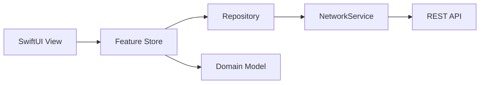

# Dueit

> An iOS app for keeping up with recurring chores and household supplies

Dueit helps people living independently keep track of recurring chores and running out of everyday supplies. Instead of relying on memory, it calculates upcoming chores and estimated stock depletion so users can focus on what needs attention now.

## Core Features

### Chore Management

- Create recurring chores for weekly, biweekly, or monthly schedules
- Set fixed schedules by weekday, date, or month
- Organize chores by room and sort them by due date
- Automatically calculate the next due date after completion

### Household Stock Management

- Estimate remaining days from current quantity and usage patterns
- Group items by when they need to be purchased: within a week, within two weeks, or later
- Update quantities and edit or delete stock items
- Surface items that are running low in the Home shopping list

### Home Dashboard

- View chores and shopping items in one place
- Organize tasks from this week through next month
- Complete a chore with a long-press and swipe interaction
- Guide first-time users through the core interaction with an onboarding flow

## Engineering Highlights

### Responsive UI with Server Reconciliation

Feature stores own screen state while repositories handle data access. Cache TTLs prevent unnecessary refetching when users move between tabs, and in-flight request deduplication prevents concurrent requests for the same data.

Mutations are reflected locally whenever possible so the interface responds immediately. Failed requests restore the previous state. For operations such as recurring chore completion, where client-side calculations can differ from server rules, the app performs a background reconciliation. Mutation revisions prevent stale responses from overwriting newer user actions.

### Domain Modeling for Recurrence Rules

Server DTOs are kept separate from the app's recurrence model. Values such as `PER_WEEK` and `FIXED_DAY` are mapped to a type-safe `RecurrenceRule` used by the UI and scheduling logic.

The next-due calculation handles weekly and monthly schedules as well as fixed weekdays, month-end dates, invalid calendar dates, and year transitions.

### Session Recovery Without Blocking App Launch

The app creates a guest session using an installation identifier, without requiring account creation. Access and refresh tokens are stored in the Keychain, with support for proactive token refresh and recovery after `401 Unauthorized` responses.

Session preparation runs independently from the initial UI presentation, so a slow or unavailable network does not block the user from entering the app.

### Push Notification Synchronization

APNs and Firebase Cloud Messaging are integrated with server-side token registration. FCM token changes are synchronized with the backend, notification setting updates are debounced to avoid redundant requests, and notification payloads are connected to in-app navigation.

## Data Flow

- `View`: Renders UI and forwards user actions
- `Store`: Owns screen state, caching, optimistic updates, and rollback
- `Repository`: Handles feature-level data access and response mapping
- `NetworkService`: Performs requests, decodes responses, recovers sessions, and normalizes errors

## Tech Stack

| Area | Technology |
| --- | --- |
| Platform | iOS 17.6+ |
| UI | SwiftUI, UIKit Haptics |
| Concurrency | Swift Concurrency, Combine |
| Networking | Alamofire |
| Push Notifications | APNs, Firebase Cloud Messaging |
| Local Storage | Keychain, UserDefaults |
| Animation | Lottie |
| Testing | Swift Testing, XCTest |

## Testing

Date and recurrence rules are covered first because a small calculation error can change the user's entire schedule.

- Mapping between recurrence DTOs and domain rules
- Next-due calculation for weekly, monthly, and fixed schedules
- Boundary cases such as month-end dates, invalid calendar dates, and year transitions
- Stock classification based on remaining days
- Stock form validation

Tests can be run individually from Xcode's Test Navigator or together with `Command + U`.
